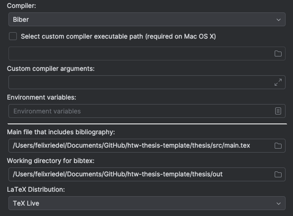
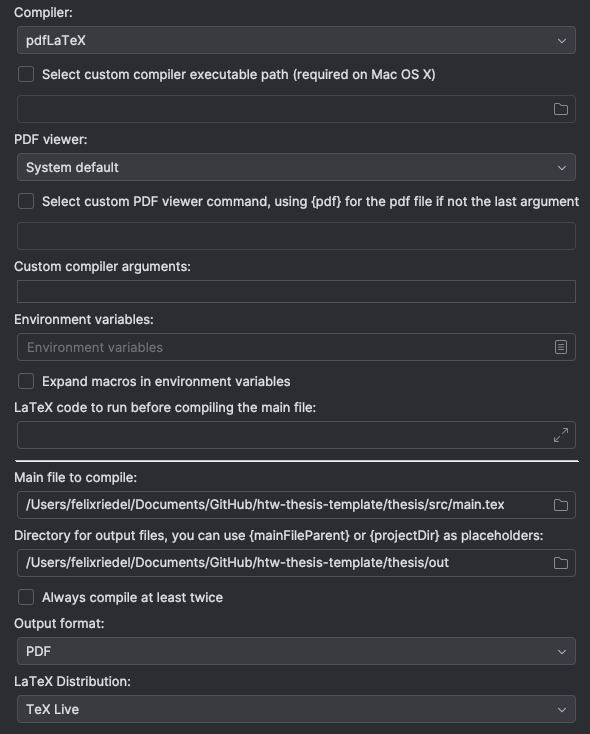
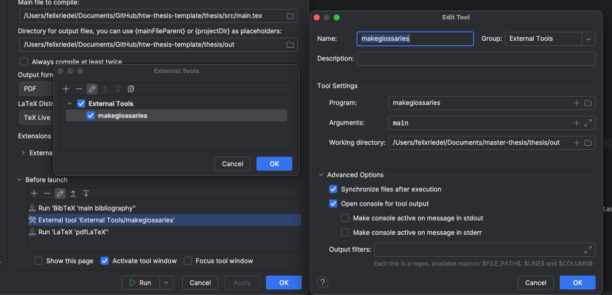

# HTW Master's Thesis Template

by yours truly Felix Riedel

## Usage

I prefer using IntelliJ in combination with GitHub as a free alternative to Overleaf.
An `.idea` folder already exists that holds the run configs for compiling the documents locally.


Run `pdfLatex (all)` for everything to work, otherwise bibliography, glossaries and links might be broken.

Alternatively just copy everything into overleaf and it should work like a charm too.

## Prerequisites

- [TexLive](https://tug.org/texlive/) Compiler
- IntelliJ [Texify](https://plugins.jetbrains.com/plugin/9473-texify-idea) Extension 

## Settings


Make sure to set the correct compiler and LaTeX/BibTex distributions in the run configurations / Overleaf:
- pdfLaTeX
- Biber
- TexLive

They should be on your system once you installed Texify and TexLive.

### Bibliography


### pdfLaTeX 


### Glossaries

For glossaries to work the terminal command `makeglossaries` needs to run.
You need to define it as an external tool in IntelliJ.




## Document Language

The document language is English (except for one abstract which is german).
Use babel to change the language to your preferences:

```
\begin{document}
    \selectlanguage{ngerman}
    ...
\end{document}
```

Make sure to change the language after `\begin{document}`.
This will apply to automatic titles which are generate by `\tableofcontents`, `\listoffigures` or similar commands.

Note: Some sections, titles, words eg. Blocking Notice will need to be translated manually.